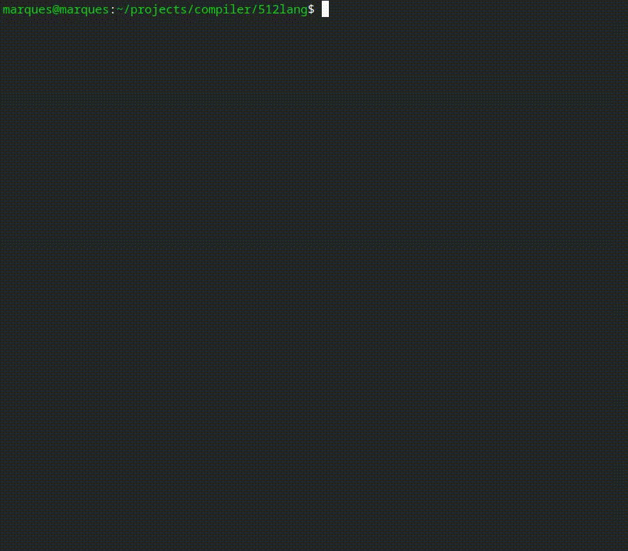

# 512lang — An Experimental Language That Writes Its Own ELF
### [**Visit 512lang Online**](https://512lang.maruqes.com/) - Interactive demos, tutorials, and live compiler playground!

512lang is a tiny, educational systems language that compiles directly to native ELF64 binaries. It skips libc and linkers entirely: the compiler emits the ELF header, program header, code, and data, and talks to the Linux kernel via raw syscalls. The goal is to serve as a proof‑of‑concept and a learning playground for low-level code generation, calling conventions, and OS interfaces.


## Quick Example

The language syntax is evolving. A minimal “hello” conceptually looks like this:

```512lang
// hello.lang
include("lang/liblang/strings.lang")

func main() {
    print("Hello, World!\n");
    return;
}
```

The compiler lowers this to raw syscalls and emits a complete ELF64 with aligned segments and a data pool (strings/globals). For how the data pool and relocation of addresses work, see [`c_backend/raw_vars/STRING_CONSTANTS.md`](c_backend/raw_vars/STRING_CONSTANTS.md).


## Examples
Download and try it on [`EXAMPLES.md`](EXAMPLES.md)

#### Practical examples live under `lang/` and are collected in [`EXAMPLES.md`](EXAMPLES.md) for quick reference.
#### See [`EXAMPLES.md`](EXAMPLES.md) for build-and-run commands.


## Build

Prerequisites (Linux x86-64):
- Go (1.21+ recommended)
- GCC and Make
- SWIG
- A recent Linux kernel (for liblang)

Build steps:
```bash
make clean
make all         # builds C backend → bin/libbackend.a
make swig        # generates SWIG bindings → swig/backend_wrap.c
go build -o compiler main.go
```

## Use

CLI:
```bash
./compiler <input.lang> <output-elf>
```

Example (matches the repo’s workflow):
```bash
./compiler features.lang hello_elf_64
chmod +x hello_elf_64
./hello_elf_64
```

Alternatively, use the canned workflow:
```bash
make run
```

Notes:
- The compiler is intentionally minimal and targets Linux x86_64 only.
- Binaries are standalone (no dynamic loader, no libc).


## License

GPL-3.0-only. See [LICENSE](LICENSE).

—
No libc • No linker • Just syscalls